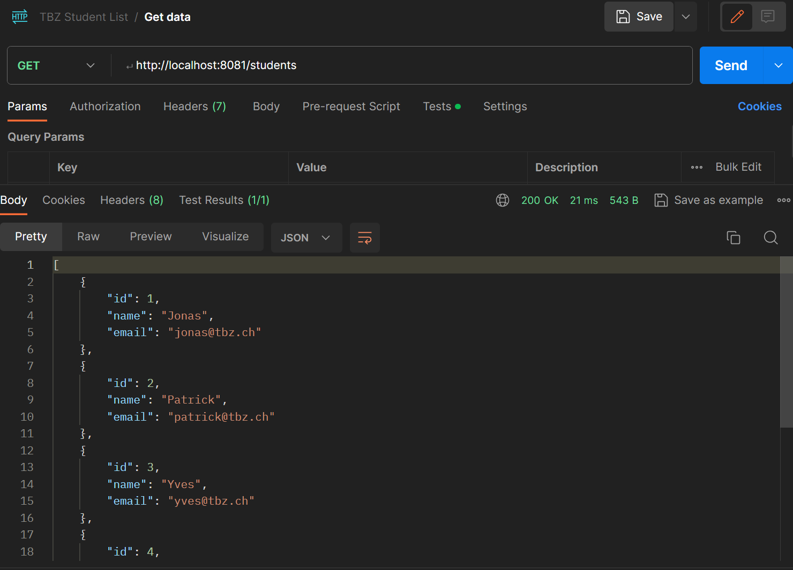
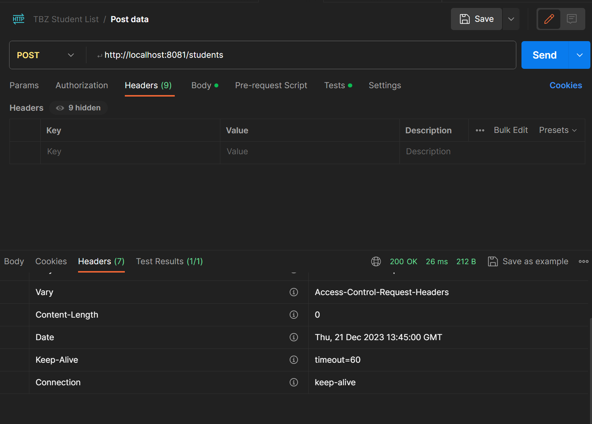
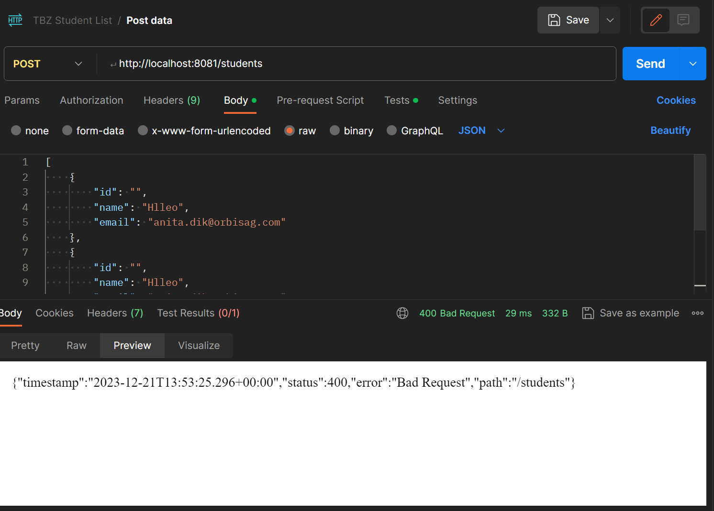
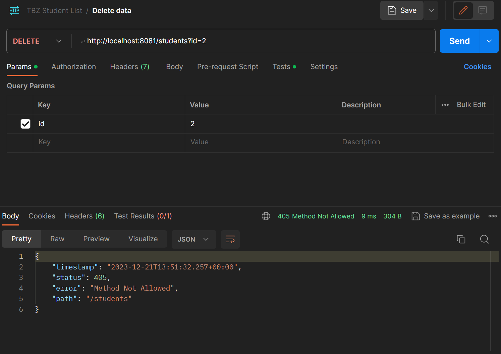
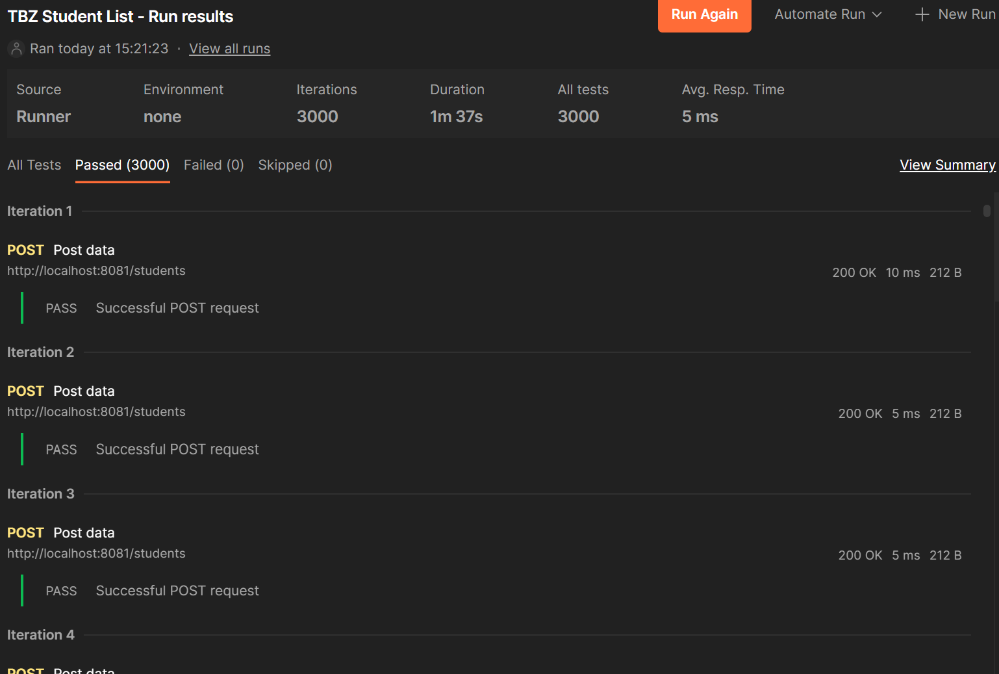

# Automation Testing

## Aufgabe 1

Als API-Client haben wir Postman ausgewählt

### Get all students ✅

### Post a student ✅

### Get one student ❌

### Post Many students❌

### Delete one student ❌

### High Traffic ✅

